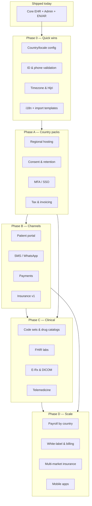

# Product Requirements Document (PRD)
## Clinic Management System (CMS)

| Field | Value |
|---|---|
| **Document Title** | Clinic Management System – Product Requirements Document |
| **Version** | 1.6 |
| **Status** | Living document (aligned with `main` as of July 2026) |
| **Author** | Product / Engineering |
| **Last Updated** | July 2026 |
| **Related Documents** | [`Clinic_Management_System_RFC.md`](./Clinic_Management_System_RFC.md), [`AWS_Cloud_Deployment_Guide.md`](./AWS_Cloud_Deployment_Guide.md), [`Test_Data_Users.md`](./Test_Data_Users.md) |

---

## 1. Executive Summary

The Clinic Management System (CMS) is a multi-tenant, multi-branch SaaS platform that enables healthcare organizations to operate clinical, administrative, financial, and human-resource functions from a single source of truth. It combines an Electronic Health Record (EHR) with prescription management, multi-branch governance, expense tracking, HR, and bilingual (English/Arabic) experiences.

The product targets clinic groups that operate one or more parent clinics with sister or sub-branches, and need centralized oversight without sacrificing per-branch autonomy.

**Tenancy (decided):** The platform is **multi-tenant SaaS**. One deployed application serves many **organizations (tenants)** on shared infrastructure. Each clinic group is a tenant; users authenticate into exactly one tenant (except the platform operator account). See [§3.4 Tenancy & deployment model](#34-tenancy--deployment-model).

The MVP focuses on operational efficiency, data integrity, and a clean clinical workflow; later phases extend into analytics, patient self-service, and integrations with external systems (labs, pharmacies, insurance, national health IDs). A phased **international expansion roadmap** (quick wins through multi-market execution) is defined in [§13](#13-international-expansion-roadmap).

## 2. Problem Statement

Independent and group clinics today rely on a patchwork of paper records, spreadsheets, and disconnected point solutions for EHR, billing, payroll, and inventory. This produces:

- Fragmented patient histories across branches.
- Inconsistent prescription practices and difficulty tracking medication safety.
- Limited visibility into branch-level financial performance (expenses, salaries, utilization).
- Manual HR processes (attendance, leave, payroll) that scale poorly.
- No support for bilingual patient populations in regions where Arabic is required alongside English.

The CMS solves these by unifying clinical and operational data within one bilingual platform that respects the parent–branch hierarchy.

## 3. Product Vision & Goals

### 3.1 Vision
Become the operating system for clinic groups in bilingual markets — clinically rigorous, financially transparent, and operationally simple.

### 3.2 Strategic Goals
1. Deliver a complete EHR experience that clinicians actually want to use.
2. Provide group-level governance over a network of branches.
3. Make clinic finances and workforce management measurable and predictable.
4. Be fully bilingual (English/Arabic) with proper RTL support, not bolted on.
5. Be deployable to a new clinic in under one business day.

### 3.3 Non-Goals (for v1)
- Hospital-grade inpatient management (wards, OR scheduling, ICU).
- Telemedicine video infrastructure (planned for v2).
- Insurance claims adjudication engine (basic claims only in v1).
- Pharmacy POS / retail dispensing.
- **Dedicated single-tenant deployment per customer as the default product SKU** (supported as an enterprise hosting option, not the primary model).

### 3.4 Tenancy & deployment model

| Concept | Definition |
|---|---|
| **Platform** | One SaaS product instance (e.g. AWS stack in `eu-central-1`) operated by Kiorly / the software vendor. |
| **Tenant (organization)** | One clinic **group** — customers who subscribe. Has its own users, clinics, patients, ledger, and settings. Identified by `tenantId` on all business data. |
| **Clinic / branch** | A site within a tenant (HQ parent or branch). Not a separate tenant. |
| **Platform Super Admin** | Vendor operator with **no** `tenantId`; provisions new tenants on the shared platform. |

**Decision: multi-tenant SaaS (not one deployment per clinic group by default).**

| Model | Description | Status |
|---|---|---|
| **Multi-tenant SaaS (default)** | Shared PostgreSQL schema; every row scoped by `tenantId`; many organizations on one App Runner + RDS stack. Platform admin creates tenants via `/platform`. | **Implemented** |
| **Dedicated single-tenant** | Same codebase, separate AWS stack and database for one customer only (one tenant populated). Stronger isolation for enterprise contracts. | **Supported as hosting option**, not separate product fork |
| **Single-tenant per VM** | Customer runs their own copy on Lightsail/EC2. | Documented in AWS guide; ops responsibility on customer |

**Isolation guarantees (current build):**
- JWT carries `tenantId`; API handlers reject cross-tenant access.
- Unique constraints are **per tenant** (MRN, national ID, phone).
- Platform APIs (`/admin/platform/*`) are restricted to `PLATFORM_SUPER_ADMIN`.
- Org-scoped admins never see another tenant’s data unless break-glass email allowlist is configured for support tooling.

**Future hardening (not required for MVP):** PostgreSQL row-level security (RLS), per-tenant encryption keys, dedicated DB per enterprise tenant.

## 4. Target Users & Personas

| Persona | Role | Primary Needs |
|---|---|---|
| **Platform Super Administrator** | SaaS operator (no tenant) | Create organizations, clinics, and initial users on the shared platform |
| **Group Administrator** | Owns the clinic group | Branches, users, org settings, org-wide patients, governance |
| **Group Supervisor** | Org-wide oversight | Patients, appointments, encounters, operations, finance views (no Admin/HR) |
| **Branch Manager** | Runs assigned clinic(s) | Staff, expenses, schedules, scoped operations |
| **Clinic Administrator** | Scoped to assigned clinics | Same as branch manager patterns; clinic-scoped API filters |
| **Clinic Assistant** | Front office / clinical support | Patient registration, appointments, encounters, operations |
| **Physician / Clinician** | Clinical care | Own schedule, encounters, prescriptions, doctor revenue |
| **Nurse / Medical Assistant** | Supports clinical workflow | Vitals capture, triage, appointment prep |
| **Receptionist / Front Desk** | Patient intake and scheduling | Registration, appointment booking |
| **Call Center** | Remote booking | Org-wide patients & appointments (read/book) |
| **HR Officer** | Manages employees | Onboarding, attendance, leave |
| **Finance Officer** | Tracks money | Expense entry, revenue, reports |
| **Patient (Indirect, v2)** | Receives care | View records, prescriptions, appointments |

## 5. Scope

### 5.1 In Scope (v1)

**Platform & tenancy**
- **Multi-tenant SaaS** with platform super-admin onboarding (organizations, clinics, users).
- Shared-schema isolation by `tenantId`; optional dedicated deployment for enterprise (hosting pattern).

**Clinical & patients (implemented on `main`)**
- Patient registry with bilingual names, optional DOB (**calculated age on profile**), **unique phone per tenant**, national ID, acquisition tracking, registration documents (camera capture), edit/delete (role-gated — includes **Call Center** and **Group Supervisor**).
- Patient profile: vitals history, encounters, **clinical document sections** (labs, radiology, prescriptions, other) with **in-app viewer** (pinch zoom, swipe/gallery navigation), **crop** (confirm before replace), and **delete** (confirm dialog); national ID / SSN / passport scan surfaced in **Other documents**.
- Encounters: SOAP, vitals, ICD-10 diagnoses, medications, lab/radiology/Rx uploads, generate prescription image, finalize workflow.
- Appointments: schedule, status lifecycle, physician/clinic scope.
- Surgical **operations** module (schedule, balance, documents, medications, revenue linkage, **full scheduled edit** parity with create form).

**Financial & HR**
- Expense tracking with proof uploads; revenue ledger (visit fees, manual entries, operations); **reports bound to global reporting period** (performance summary, per-clinic breakdown, multi-currency P&L charts).
- **Multi-currency fees** — clinic `defaultCurrency` (EGP, USD, OMR, SAR, AED); per-operation `feeCurrency`; expense currency defaults to clinic with optional override; UI amount labels reflect active currency.
- **Patient invoicing** — clinic invoice templates (logo, sections, background); invoice PDF generation from encounters/operations.
- **Prescription branding** — per-clinic header logo and bilingual description on generated Rx images.
- HR: employees, attendance, leave; employee ID document upload; **linked user ↔ employee (1:1)** with **deactivate / archive (soft) / restore / re-hire** and employment + operating period history.

**Administration**
- Organization settings, clinics (parent/branch), users, feature flags, audit log.
- **Organization user lifecycle** — deactivate, archive (soft delete), restore; archived user list with created/deactivated/archived dates; login blocked when inactive.
- **Clinic lifecycle** — disable/reactivate clinics and branches; operating period timeline; disabled clinics hidden from operational pickers.
- Org patients CRUD, bulk patient delete, bulk user archive, data explorer, **SQL export** and **documents ZIP export** (group admin / break-glass).
- Expanded **audit trail** for patient/encounter views, clinical document list/view/upload/delete/crop (visible in Governance).

**Experience**
- Bilingual UI (English / Arabic with RTL).
- Role-based access control and clinic scope for admins/physicians.
- Responsive web SPA (no native mobile app in repo).

### 5.2 Out of Scope (v1)
- Patient mobile app.
- Telemedicine.
- Lab equipment integration.
- Government health insurance claim submission (manual export only).
- Inventory management beyond basic materials expense tracking.

## 6. Functional Requirements

### 6.1 Electronic Health Record (EHR)

> **Legend:** Bullets in **Patient Record**, **Prescriptions**, and **Clinical Safeguards** below describe the **full EHR product vision**. Subsections **6.1a–6.1f** describe what is **shipped** in the current web/API build.

**Patient Record (roadmap)**
- Unique patient ID per group (visible across branches that the patient consents to).
- Demographics: name (EN/AR), DOB, gender, national ID/passport, contact, address, emergency contact.
- Medical history: allergies, chronic conditions, family history, surgical history, social history.
- Vitals capture: BP, HR, temperature, weight, height, BMI, SpO₂.
- Encounter notes: chief complaint, examination, assessment, plan (SOAP format).
- Attachments: lab reports, imaging, scanned documents (PDF, JPG, PNG, DICOM in v2).
- Diagnoses with ICD-10 coding.
- Procedures with CPT coding (configurable).
- Visit timeline showing all encounters across branches (with consent rules).

**Prescriptions (roadmap)**
- Drug catalog (sourced from configurable list; v2 integrates with national drug registries).
- Per-prescription fields: drug name, strength, dosage form, route, frequency, duration, quantity, refills, instructions (EN/AR).
- Drug–drug interaction check (basic ruleset in v1, full clinical engine in v2).
- Drug–allergy alert.
- Prescription history view per patient.
- Print prescription with clinic letterhead, doctor signature/stamp, both languages.
- Digital prescription PDF download.

**Clinical Safeguards (roadmap)**
- Amendments recorded with reason and timestamp; original retained.
- Doctor authentication required for finalizing notes and prescriptions.

### 6.1a Appointments & encounters (current build)

- **Appointment statuses:** Scheduled (default when booking), Confirmed, Cancelled, Completed. The appointment record is read-only after Completed.
- **Encounter link:** An optional booked appointment (same patient) may be attached when creating an encounter; linking sets the appointment to **Confirmed**; **finalizing** the encounter sets it to **Completed**.
- **Visit fee** is set on **encounter** creation (tenant default in administration; **display and revenue use the clinic’s `defaultCurrency`**); amounts greater than zero create a `VISIT_FEE` revenue ledger line. Appointments do not store a fee.
- **Physician experience:** The web app exposes **Appointments** in the main navigation for physicians. List and detail APIs return only appointments where the JWT user is the **attending clinician**; physicians may only **book** appointments as themselves. The appointments ledger table highlights **clinic** (localized name) for at-a-glance branch context.
- **Clinic administrator:** Appointment lists are limited to clinics in the administrator’s **scope**; detail and mutations outside that scope are denied.

### 6.1b Patient registry & profile (current build)

**Registration (Patients → New patient)**
- Required: English/Arabic names (Arabic first and last required), gender, phone. **Date of birth is optional.**
- **Phone uniqueness:** Each phone number may belong to only one active patient per organization. While typing, the form checks for conflicts, highlights the phone field, shows the existing patient’s name/MRN, and links to their profile; **Create patient** stays disabled until resolved.
- Optional: email, national ID, national ID scan (PDF/image), home branch, **how did they find us?** (social, website, doctor referral with name, other with free text).
- Optional **attached documents** at registration: type **Lab results**, **Radiology**, **Prescription**, or **Other** (custom description); multiple photos/files per row; in-browser **camera capture** on supported devices.

**Patient list & administration**
- Search/filter by MRN, phone, name, national ID, gender; column filters; pagination and sort.
- **Soft delete** (single or bulk) for **Group Admin**, **Group Supervisor**, **Call Center**, **Clinic Admin**, **Clinic Assistant**, and **Branch Manager** (with confirm dialog in the UI).
- **Group Admin** also manages patients under **Administration → Organization patients** (create/edit, bulk delete, filters).

**Patient profile**
- Demographics with **calculated age** when date of birth is set (e.g. `15/05/1990 · 35 years`), optional national ID download, acquisition source, local profile photo (browser storage).
- **Vitals history** and **encounters** list (role-gated) with pagination.
- **Clinical document sections:** **Lab results**, **Radiology**, **Prescriptions**, and **Other documents** — aggregated from registration uploads, encounter documents, and the **national ID / SSN / passport scan** (shown in **Other** with `source: nationalId`; not deletable/croppable from the profile). Per-section **+ Add** uploads from the profile.
- In-app **document viewer:** images support **pinch zoom**, **swipe** (or arrow controls) for multi-image galleries, **download**, **crop** (confirmation before replacing the stored file), and **delete** (confirmation dialog) for patient and encounter documents except the national-ID scan.
- Encounter-sourced items link back to the visit.
- **Edit patient** (demographics dialog) for Group Admin, Group Supervisor, Call Center, Clinic Admin, Clinic Assistant, and Branch Manager — includes the same phone conflict check on save.
- **New encounter** shortcut from profile (when encounters nav is allowed).

**API highlights:** `GET /patients/phone-conflict`, `GET /patients/:id/clinical-documents`, document upload/download/delete/crop endpoints (patient and encounter paths), `PATCH /patients/:id`, `POST /patients/bulk-delete`.

### 6.1c Encounters & clinical documents (current build)

- Encounter editor: SOAP fields, structured vitals, ICD-10 diagnoses, medications, **lab / radiology / prescription** document uploads per visit, optional **generate prescription** image from manual meds, finalize workflow.
- **Mandatory attending doctor** validation and field highlighting on save when required data is missing.
- Patient profile clinical sections roll up encounter documents by kind across all visits the user is allowed to see (respecting physician/clinic scope).

### 6.1d Organization administration (current build)

Beyond tenant settings and clinic directory, **Group Admin** (and platform break-glass where configured) can use:
- **Organization patients** — full CRUD aligned with the registry.
- **Organization users** — create users; **bulk delete** selected or filtered users.
- **Data explorer** — read/write on allowlisted tenant tables (patients, encounters, documents, etc.).
- **SQL export** — selectable entity subsets for backup/analysis.
- **Documents ZIP export** — downloads uploaded blobs (patient/encounter/operation documents, national ID scans, expense proofs, employee ID docs) from local disk or S3 into a ZIP with `manifest.json`; entity filter mirrors SQL export.
- **Governance / audit** — org-wide audit log tail for administrators (includes views of patients/encounters, clinical document list/view/upload/delete/crop, and other sensitive reads).

See [`Test_Data_Users.md`](./Test_Data_Users.md) for demo logins and QA scenarios.

### 6.1e Operations (current build)

- Schedule **operations** (procedures) per clinic with patient, clinician, date, cost, down payment, and balance.
- **`feeCurrency`** per operation (EGP, USD, OMR, SAR, AED) — defaults to the clinic’s **`defaultCurrency`**; revenue posts in the operation currency.
- Status workflow posts or voids linked **revenue** when completed or cancelled; completion dialog collects remaining balance in the operation currency.
- Attach documents and medications per operation (same patterns as encounters).
- **Scheduled edit parity:** edit dialog matches create layout (fieldset sections, two-column grids on desktop, responsive scroll on mobile); `GET /operations/:id` loads clinical detail; `POST /operations/:id/reset-clinical` replaces meds/docs on save.
- **Completed operation correction:** group/clinic admins may edit fees, patient, clinician, and comments; linked revenue updates automatically.
- Physicians see only operations where they are the assigned clinician; clinic-scoped roles see assigned clinics.

### 6.1f Platform tenancy & clinic currency (current build)

- **`PLATFORM_SUPER_ADMIN`** user (`tenantId: null`) uses the **Platform** tab only: create/list/edit organizations, clinics under any tenant, users, feature flags.
- Each **organization** has independent base currency, locale, default visit fee, clinics, and user directory.
- Each **clinic** stores **`defaultCurrency`** (one of EGP, USD, OMR, SAR, AED) used for visit fees, expense defaults, and operation defaults unless overridden per operation.
- Demo seed includes multiple tenants (Kiorly demo, Dr Ahmed Shall Group, shell orgs) on one database — see [`Test_Data_Users.md`](./Test_Data_Users.md).
- Production deployment: single CloudFront URL, App Runner API, RDS — see [`AWS_Cloud_Deployment_Guide.md`](./AWS_Cloud_Deployment_Guide.md).

### 6.1g HR employee lifecycle (current build)

- **Employee record status:** `ACTIVE` or `SEPARATED` with optional resignation date and separation reason.
- **Employment periods:** each hire and separation tracked in `EmployeeEmploymentPeriod` (start/end dates, reason); visible on employee detail.
- **Deactivate:** HR officer and admin roles end the current period and set record to separated (does not delete the row).
- **Re-hire:** HR officer and admin roles open a dialog with **re-hire date**, start a new employment period, and return the employee to active.
- **Permanent delete:** only **Group admin**, **Branch manager**, and **Clinic admin** (API `EMPLOYEE_DELETE_ROLES`); HR officer may manage lifecycle but not hard-delete records.
- New employee onboarding remains under **Administration** for org/clinic admins; HR module is the operational hub for directory, attendance, and leave.

### 6.2 Multi-Branch Support

- **Tenant** = clinic group. **Clinic** = parent HQ or branch within that tenant.
- Group structure: one **Parent Clinic** may own multiple **Branches** (sister or sub-clinics); branches may also be modeled as standalone roots under the tenant (flat layout).
- Each branch has its own staff roster, schedule, expenses, and financial attribution by `clinicId`.
- **Patient records are tenant-scoped** (shared across all branches in the organization). Branch visibility for operations is enforced by **role and clinic scope**, not separate patient registries per branch.
- Group-level reports roll up branch data; branch-level views filter by clinic.
- A user may hold different roles or clinic assignments within the same tenant.
- **Patient consent for cross-branch sharing** — product vision; not a separate consent module in the current build.

### 6.3 Expense Management

Expense categories (extensible):
- **Salaries** – synced from HR/payroll outputs.
- **Materials** – medical supplies, consumables, office supplies.
- **Utilities** – electricity, water, internet, telecom, rent.
- **Other** – marketing, maintenance, professional services.

Each expense entry records: branch, category, sub-category, vendor, amount, **currency** (defaults to clinic `defaultCurrency`; EGP, USD, OMR, SAR, AED), tax, payment method, date, supporting document (receipt/invoice upload), entered-by user.

Reporting: monthly/quarterly/annual expense by branch, by category, group consolidation, year-over-year comparison, expense vs. revenue.

### 6.4 HR Module

- **New employee registration** for organization and clinic administrators is performed under **Administration** (employment type, salary, clinic assignment, optional ID document). The HR area remains the operational hub for directory, attendance, and leave.
- **Employee directory** per branch with profile, contract, documents (ID, license, certifications, expiry tracking).
- **Roles & employment type** (full-time, part-time, contractor, locum).
- **Attendance** – clock in/out, manual entry, biometric integration hook.
- **Leave management** – annual, sick, unpaid, custom; approval workflow.
- **Payroll inputs** – base salary, allowances, deductions, overtime; export to payroll system or generate payslip PDF.
- **Performance & licensing** – track license expiry (medical license, board certification), automatic alerts.

### 6.5 Localization (English & Arabic)

- All UI strings translatable; no hard-coded text.
- Right-to-Left (RTL) layout for Arabic, including form alignment, navigation, charts, and tables.
- Bilingual data fields where appropriate (patient name, drug instructions, clinic name).
- Date/time formatting per locale (Hijri calendar display optional).
- Number and currency formatting per locale.
- Printed documents (prescriptions, invoices, reports) available in either language or bilingual.
- Language switch available per user; defaults at clinic level.

### 6.6 Admin Dashboard

- Manage **clinics** (parent/branch) **within the signed-in organization** (tenant).
- Manage users, roles, clinic assignments, optional **nav tab grants**, and feature flags.
- View group-level KPIs: patients, encounters, revenue, expenses, headcount (dashboard + reports).
- **Group administrators** use organization admin tabs; **platform-only** tools (cross-tenant directory, provisioning) require `PLATFORM_SUPER_ADMIN`; raw **data explorer** also available to group admin and break-glass allowlist emails.
- Subscription / licensing billing integration — future SaaS commercial layer.

### 6.6.0 Platform super administration

A dedicated **Platform Super Administrator** operates **outside any organization** (`tenantId: null`, role `PLATFORM_SUPER_ADMIN`). This is the **SaaS vendor** account used to onboard paying clinic groups onto the **shared multi-tenant** instance.

| Capability | Description |
|---|---|
| **Platform overview** | Cross-tenant KPIs: organization count, users, clinics, patients, encounters |
| **Create organization** | Name, base currency, default locale; atomically provision the first **Group Admin** (email/username + password + display name) |
| **Optional HQ clinic** | When creating an organization, optionally create the first parent (HQ) clinic in the same transaction |
| **List & manage organizations** | Paginated directory with per-org user/clinic/patient counts |
| **Organization settings** | Update name, currency, locale, default visit fee for any tenant |
| **Clinic provisioning** | Add parent clinics or branches under any organization |
| **User provisioning** | Create any organization role; assign clinics for clinic admin / branch manager |
| **User directory** | List all users within a selected organization |
| **Global feature flags** | View and toggle platform-wide feature flags |

**Out of scope for the dedicated platform account:** clinical workflows (patients, encounters, prescriptions), org-scoped finance/HR, and the raw data explorer (reserved for legacy break-glass org admins via email allowlist). The platform super admin signs in to the **Platform** tab only (plus Profile).

**Representative user story:** *As a Platform Super Administrator*, I want to create a new clinic group with a group admin login in one step so the customer can sign in and complete clinic onboarding immediately.

### 6.6.1 Reports & analytics

- The **Reports** area charts **visit volume** (finalized encounters), **posted revenue**, and **new patient registrations** per calendar month from live ledger and patient data—not illustrative placeholders.
- **Patient acquisition** breakdown (how patients found the clinic) with date range filter; each channel row is **clickable** to open a paginated patient list dialog for that channel and period.

### 6.7 Clinic Onboarding Form

When adding a clinic (parent or branch), the following fields are captured:

| Field | Type | Required | Notes |
|---|---|---|---|
| Clinic Name (EN) | Text | Yes | |
| Clinic Name (AR) | Text | Yes | |
| Logo | Image upload | Yes | PNG/JPG/SVG; size and dimension constraints |
| Specialities | Multi-select | Yes | From configurable master list (e.g., GP, Dermatology, Pediatrics) |
| Country | Dropdown | Yes | ISO country list |
| City | Dropdown / Text | Yes | Driven by selected country |
| Full Address | Multiline text | Yes | Bilingual support |
| Location Link | URL | Yes | Validated as URL (e.g., Google Maps link) |
| Parent Clinic | Reference | Conditional | Required when adding a sub/sister clinic |
| Phone | Text | Yes | International format |
| Email | Email | Yes | |
| License Number | Text | Yes | Regulatory clinic license |
| Working Hours | Schedule | Yes | Per day, supports breaks |
| Default Language | Enum (EN/AR) | Yes | |
| Default Currency | Enum (EGP/USD/OMR/SAR/AED) | Yes | Drives visit fees, expense defaults, and operation defaults for this clinic |

### 6.8 Roles & Permissions

**Implemented roles** (`UserRole` enum): Platform Super Admin, Group Admin, Group Supervisor, Branch Manager, Clinic Admin, Clinic Assistant, Physician, Nurse, Receptionist, Call Center, HR Officer, Finance Officer.

Authorization model:
- **Role-based** checks in services and controllers (e.g. physician sees own encounters; clinic admin filtered by `ClinicAdminScope`).
- **Patient create/edit/delete** (list and profile): Group Admin, Group Supervisor, Call Center, Clinic Admin, Clinic Assistant, Branch Manager (`PATIENT_MANAGE_ROLES` on API).
- Optional **nav tab grants** per user to hide/show main navigation areas.
- Custom permission matrix / auditor role — roadmap; not fully implemented as configurable CASL matrix.

### 6.9 Audit & Compliance

- **Audit log** records administrative and sensitive actions plus selected reads (patient/encounter detail, clinical documents list, document view/download, national ID view) and document mutations (upload, delete, crop). Org admins review entries under **Admin → Governance & audit**.
- Login via JWT; session in SPA until logout or expiry.
- Soft-delete for patients (retain row with `deletedAt`).
- Configurable data retention, login history export, formal patient consent module — roadmap.

## 7. Non-Functional Requirements

| Category | Requirement |
|---|---|
| **Performance** | P95 page load < 2s on broadband; encounter save < 1s |
| **Availability** | 99.9% monthly uptime target |
| **Scalability** | Support 500 branches and 5M patients per tenant in v1 design |
| **Security** | TLS 1.2+, encryption at rest, RBAC, MFA for admins (roadmap), secrets in AWS Secrets Manager |
| **Multi-tenancy** | Shared schema with application-level `tenantId` isolation; unique business keys per tenant; platform admin segregated |
| **Compliance** | Alignment with applicable health-data regulations in target markets (e.g., DHA/MOH in UAE, HIPAA-equivalent controls); data residency configurable per tenant |
| **Backup & DR** | Daily backups, point-in-time recovery, RPO ≤ 1h, RTO ≤ 4h |
| **Accessibility** | WCAG 2.1 AA |
| **Browser Support** | Latest two versions of Chrome, Edge, Safari, Firefox |
| **Mobile** | Responsive web in v1; native apps in v2 |

## 8. User Stories (Representative Sample)

- *As a Platform Super Administrator*, I want to create a new organization with a group admin in one step so the customer can sign in immediately on the shared SaaS instance.
- *As a Receptionist*, I want immediate feedback when a phone number already belongs to another patient so I do not create duplicate records.
- *As a Call Center agent*, I want to search and book appointments across the organization so I can serve patients remotely.
- *As a Group Admin*, I want to onboard a new sub-clinic in one form so that branches can go live quickly.
- *As a Physician*, I want to see the patient's full history from any branch so that my decisions are informed.
- *As a Physician*, I want drug–allergy alerts at prescription time so that I avoid harm.
- *As a Branch Manager*, I want each clinic’s default currency on fees and expenses so that financial reports match how we collect payment locally.
- *As a Receptionist*, I want to record an operation in the currency the patient actually paid (e.g. AED) even when the clinic default is EGP.
- *As an HR Officer*, I want to re-hire a returning employee with a new start date without creating a duplicate record.
- *As a Group Admin*, I want to permanently remove test employee records while HR can only deactivate them.
- *As an HR Officer*, I want automatic alerts before a clinician's medical license expires so that we stay compliant.
- *As an Arabic-speaking Receptionist*, I want the entire UI in RTL Arabic so that I can work fluently.
- *As a Finance Officer*, I want to consolidate expenses across all branches so that I can report to ownership.

## 9. Success Metrics

- Time to onboard a new branch: ≤ 1 business day.
- Encounter completion time: ≤ 5 minutes median.
- Prescription error rate: reduction of 50% versus baseline within 6 months of go-live.
- Monthly active clinicians: ≥ 90% of licensed users.
- NPS from branch managers: ≥ 40 within 12 months.
- Expense variance reporting cycle: from monthly to weekly.

## 10. Assumptions, Dependencies, Constraints

**Assumptions**
- Clinics have basic broadband and modern browsers.
- Each branch has at least one designated administrator.
- Drug catalog and ICD-10 reference data can be licensed or sourced.
- **Default production hosting** is AWS (CDK stack: CloudFront, S3, App Runner, RDS PostgreSQL) in `eu-central-1`, multi-tenant by default.

**Dependencies**
- AWS account and GitHub Actions OIDC for deploy (see [`AWS_Cloud_Deployment_Guide.md`](./AWS_Cloud_Deployment_Guide.md)).
- SMS / email provider for notifications (not wired in current build).
- Mapping provider for location links validation.
- Identity provider for SSO (optional; JWT login implemented).

**Constraints**
- Regulatory data residency may require region-specific deployments.
- Bilingual content requires translation review before any release.

## 11. Risks & Mitigations

| Risk | Impact | Likelihood | Mitigation |
|---|---|---|---|
| Regulatory non-compliance in a target market | High | Medium | Legal review per market; configurable data residency |
| RTL/Arabic UX defects after release | Medium | Medium | Native Arabic QA from sprint one; bilingual design reviews |
| Data migration from legacy systems | High | High | Standard import templates; migration toolkit; pilot before full cutover |
| Low clinician adoption | High | Medium | Co-design with practicing clinicians; usability testing each milestone |
| Cross-branch data leakage | High | Low | Application `tenantId` checks on every query; unique keys per tenant; security review; optional RLS later |

## 12. Release Plan (Phased)

### 12.1 Delivered on `main`

#### June 2026 baseline

| Area | Status |
|---|---|
| Multi-tenant SaaS + platform super admin | Shipped |
| Clinics (parent/branch), users, RBAC, nav tab grants | Shipped |
| Patients (registry, phone uniqueness, age from DOB, clinical doc viewer/crop/delete, national ID in Other, soft delete) | Shipped |
| Reports (monthly charts, acquisition channel drill-down) | Shipped |
| Appointments, encounters (SOAP, vitals, ICD-10, meds, documents, Rx image) | Shipped |
| Operations (schedule, balance, revenue linkage) | Shipped |
| Expenses, revenue ledger, reports/monthly charts | Shipped |
| HR (employees, attendance, leave) | Shipped |
| Admin (org patients/users, data explorer, SQL + documents ZIP export, expanded audit) | Shipped |
| Bilingual EN/AR web SPA | Shipped |
| AWS deploy (App Runner + RDS + CloudFront + S3 uploads) | Shipped |

#### July 2026 increments

| Area | Status |
|---|---|
| Clinic **`defaultCurrency`** (EGP, USD, OMR, SAR, AED) on create/edit | Shipped |
| Operation **`feeCurrency`** override; revenue in operation currency | Shipped |
| Expense currency defaults to clinic; optional override on create | Shipped |
| Dynamic currency labels and `Intl` formatting on encounters, operations, expenses | Shipped |
| Scheduled operation **edit parity** with create (meds, docs, comments, responsive dialog) | Shipped |
| HR **deactivate / re-hire** with employment periods; admin-only **archive (soft)** + restore | Shipped |
| `GET /operations/:id`, `POST /operations/:id/reset-clinical` | Shipped |

#### July 2026 (late) increments

| Area | Status |
|---|---|
| **User ↔ employee lifecycle** — deactivate, soft archive, restore; cascades both sides; archived Active/Archived tabs (admin + HR) | Shipped |
| **Clinic disable / reactivate** — `ClinicOperatingPeriod` history; cascade disable branches; active/disabled directory tabs | Shipped |
| **Reports overhaul** — all charts tied to header **From → To**; clinic breakdown table; multi-currency performance P&L; mobile-responsive layout; revenue (color) vs expense (grey) styling | Shipped |
| **Multi-currency group reports** — per-clinic breakdown by currency; org/clinic scope selector | Shipped |
| **Clinic invoice settings** — logo upload, section toggles, background color; invoice module | Shipped |
| **Prescription clinic branding** — logo + EN/AR header description on Rx PDF/image | Shipped |
| Encounter visit fee ↔ linked appointment fee sync; auto-complete appointment on encounter finalize | Shipped |
| Expense submit confirmation dialog before creating pending expense | Shipped |

### 12.2 Near-term roadmap (engineering backlog)

**Phase 2 – Operational depth**
- Payroll exports and payslips; biometric attendance hooks.
- Advanced clinical features (drug interaction engine, structured lab orders, DICOM).
- Patient consent workflows; configurable permission matrix.
- MFA for admins; refresh tokens; Redis rate limiting.

**Phase 3 – Ecosystem**
- Patient portal; telemedicine; insurance claims.
- Lab and pharmacy integrations; native mobile apps.
- Per-tenant billing / subscription management.

See [§12.3 Production readiness & recommended feature backlog](#123-production-readiness--recommended-feature-backlog) for the comprehensive feature set to reach a **production-ready, feature-rich** clinic management platform.

See [§13 International Expansion Roadmap](#13-international-expansion-roadmap) for the phased plan to enter new countries (quick wins through full multi-market execution).

### 12.3 Production readiness & recommended feature backlog

This section defines the **target product** for a production-grade, feature-rich clinic management system. Items are grouped by domain and tagged by **priority** for sequencing:

| Tag | Meaning |
|---|---|
| **P0** | Required for confident production launch (security, compliance, reliability) |
| **P1** | High-value differentiators clinics expect from a paid product |
| **P2** | Competitive parity with regional incumbents |
| **P3** | Ecosystem scale and enterprise upsell |

#### 12.3.1 Security, compliance & platform hardening

| # | Feature | Priority | Rationale |
|---|---|---|---|
| F.1 | **MFA for administrators** (TOTP / email OTP) | P0 | Protect tenant-wide data and platform provisioning |
| F.2 | **Refresh tokens & session revocation** | P0 | Safer long-lived sessions; forced logout on role change |
| F.3 | **Rate limiting & abuse protection** (Redis) | P0 | Brute-force login, API scraping, upload floods |
| F.4 | **PostgreSQL RLS** (defense-in-depth on `tenantId`) | P1 | Extra isolation guarantee for multi-tenant SaaS |
| F.5 | **Audit log export** (CSV/JSON) + retention policies | P0 | Regulator and customer compliance requests |
| F.6 | **Patient consent module** (treatment, cross-branch sharing, marketing) | P1 | Required in EU/GCC expansion; versioned consent text |
| F.7 | **SSO (OIDC / SAML)** for enterprise clinic groups | P1 | Hospital-group IT standard |
| F.8 | **Break-glass access workflow** with time-bound elevation | P1 | Support without standing super-user access |
| F.9 | **WAF + bot protection** on CloudFront | P0 | Public SPA/API hardening before real PHI |
| F.10 | **Automated backup restore drills** + RPO/RTO runbooks | P0 | Prove disaster recovery, not just backup existence |

#### 12.3.2 Clinical depth (EHR excellence)

| # | Feature | Priority | Rationale |
|---|---|---|---|
| C.1 | **Structured allergies & adverse reactions** on patient chart | P0 | Safety baseline for prescribing |
| C.2 | **Drug–drug & drug–allergy interaction alerts** at Rx time | P1 | Clinician trust and liability reduction |
| C.3 | **Configurable drug catalog** per tenant/country | P1 | Replace free-text meds with searchable formulary |
| C.4 | **Clinical templates** beyond SOAP (specialty forms) | P1 | Dermatology, dental, physio, pain clinic |
| C.5 | **Structured lab orders & result ingestion** (manual → HL7 FHIR) | P1 | Close the loop on diagnostics |
| C.6 | **Problem list & chronic condition registry** | P1 | Longitudinal care across visits |
| C.7 | **Immunization schedule & vaccine documentation** | P2 | Pediatrics and travel clinics |
| C.8 | **DICOM / imaging viewer** for radiology attachments | P2 | Replace download-only for imaging |
| C.9 | **E-prescribing transmission** to pharmacies | P2 | Market-dependent legality |
| C.10 | **Clinical decision support hooks** (growth charts, pediatric dosing) | P2 | Reduce calculation errors |

#### 12.3.3 Patient access & engagement

| # | Feature | Priority | Rationale |
|---|---|---|---|
| P.1 | **Patient portal (web)** — appointments, documents, balances | P1 | Reduce front-desk load; modern expectation |
| P.2 | **Online booking widget** embeddable on clinic websites | P1 | Acquisition + self-service scheduling |
| P.3 | **SMS / WhatsApp / email notifications** (reminders, results ready) | P0 | No-show reduction; operational necessity |
| P.4 | **Two-way messaging** (staff ↔ patient, policy-gated) | P2 | Post-visit follow-up and triage |
| P.5 | **Waiting room / queue display** with token numbers | P1 | High-volume outpatient markets |
| P.6 | **Patient satisfaction surveys** after visit finalize | P2 | Quality improvement loop |
| P.7 | **Family / dependent linking** on one account | P2 | Pediatric and family practice workflows |
| P.8 | **Native patient mobile app** (iOS / Android) | P3 | Push notifications and loyalty |

#### 12.3.4 Scheduling & operations

| # | Feature | Priority | Rationale |
|---|---|---|---|
| O.1 | **Resource scheduling** (rooms, equipment, multiple physicians) | P1 | Beyond single-clinician appointment slots |
| O.2 | **Recurring appointments & treatment plans** | P1 | Physiotherapy, chronic pain, dialysis-style cadence |
| O.3 | **Waitlist & automatic slot fill** on cancellation | P2 | Revenue recovery |
| O.4 | **Branch timezone** per clinic (IANA) | P1 | Multi-city groups (see §13 Phase 0) |
| O.5 | **Public holiday calendar** warnings on booking | P2 | Reduce scheduling errors |
| O.6 | **Operation theatre checklist & consent forms** | P2 | Surgical governance |
| O.7 | **Inventory consumption** linked to operations/encounters | P2 | Cost attribution per procedure |

#### 12.3.5 Financial management & revenue cycle

| # | Feature | Priority | Rationale |
|---|---|---|---|
| R.1 | **Patient invoicing & receipt PDF** with clinic letterhead | P0 | Legal and patient-facing documentation |
| R.2 | **Online payment collection** (visit fee, operation balance) | P1 | Cash-flow acceleration |
| R.3 | **Payment gateway adapters** (Tap/HyperPay, PayMob, Stripe) | P1 | Regional payment methods |
| R.4 | **Multi-currency FX reporting** at group level | P1 | Extends current per-clinic currency (shipped) |
| R.5 | **VAT / tax lines** on revenue and expenses | P1 | GCC and EU compliance |
| R.6 | **Insurance payer directory & copay rules** | P2 | Insured patient workflows |
| R.7 | **Claims file generation** (DHA, NPHIES, etc.) | P2 | Market-specific revenue |
| R.8 | **Accounts receivable aging** (outstanding operation balances dashboard) | P1 | Extends `outstanding-balances` API |
| R.9 | **Bank reconciliation import** | P2 | Finance officer productivity |
| R.10 | **Budget vs actual** per branch/category | P2 | Branch manager control |
| R.11 | **Subscription billing** for SaaS (per branch / per clinician) | P3 | Vendor commercial layer |

#### 12.3.6 HR, payroll & workforce

| # | Feature | Priority | Rationale |
|---|---|---|---|
| H.1 | **Payroll run & payslip PDF** with country-specific fields | P1 | Complete the HR → finance loop |
| H.2 | **Salary expense auto-post** to ledger on payroll lock | P1 | Books stay in sync |
| H.3 | **Medical license & credential expiry alerts** (T-90/30/7) | P1 | Regulatory compliance |
| H.4 | **Biometric / geo-fenced attendance** | P2 | Labor law and visa audit trails |
| H.5 | **Shift scheduling & roster** | P2 | Staff planning beyond leave |
| H.6 | **Performance review cycles** | P3 | Enterprise HR |
| H.7 | **Onboarding checklist** (documents, IT access, clinic assignment) | P2 | Reduces admin errors |

*Shipped foundation:* employee directory, attendance, leave, deactivate/re-hire with employment periods, admin-only delete.

#### 12.3.7 Inventory & supplies

| # | Feature | Priority | Rationale |
|---|---|---|---|
| I.1 | **Stock catalog** (SKU, unit, reorder level) | P2 | Beyond expense-only materials tracking |
| I.2 | **Purchase orders & vendor management** | P2 | Procurement workflow |
| I.3 | **Consumption per encounter/operation** | P2 | True cost per visit |
| I.4 | **Expiry tracking** (vaccines, consumables) | P2 | Safety and waste reduction |
| I.5 | **Barcode / QR scanning** on mobile web | P3 | Warehouse and clinic stock counts |

*Shipped foundation:* employee directory, attendance, leave, deactivate/re-hire with employment periods, **soft archive + restore** (linked login user), admin-only archive.

#### 12.3.12 Admin, governance & org lifecycle

| # | Feature | Priority | Rationale |
|---|---|---|---|
| G.1 | **Bulk user import** (CSV) with role and clinic assignment validation | P1 | Faster onboarding for large groups |
| G.2 | **Org chart export** (PDF/PNG) from hierarchy view | P2 | Board and accreditation packs |
| G.3 | **Scheduled access reviews** — quarterly cert that admins still need access | P1 | SOC2 / ISO 27001 readiness |
| G.4 | **Clinic merge / rename workflow** with audit trail | P2 | M&A and rebranding without data loss |
| G.5 | **Configurable retention** — auto-archive inactive users after N days | P2 | GDPR / HR policy automation |
| G.6 | **Break-glass session recording** — video or step log for elevated support | P1 | Trust for platform operator access |
| G.7 | **Tenant data export package** (GDPR portability) on request | P0 | Legal requirement in EU expansion |

*Shipped foundation:* org users/patients CRUD, soft archive users & employees, clinic disable with operating periods, governance audit tail, data explorer SQL + documents ZIP.

#### 12.3.13 Near-term enhancements to shipped modules

Improvements that extend **already shipped** areas without waiting for a major new module:

| # | Module | Enhancement | Priority |
|---|---|---|---|
| N.1 | **Reports** | Scheduled email of P&L PDF/Excel on month close | P1 |
| N.2 | **Reports** | FX normalization using daily ECB/Central Bank rates (extends multi-currency display) | P1 |
| N.3 | **Reports** | Physician-level revenue & visit drill-down from clinic breakdown | P1 |
| N.4 | **Dashboard** | Real-time “today” tiles (appointments, waiting, collections) alongside period KPIs | P1 |
| N.5 | **Encounters** | Appointment wait-time and cycle-time metrics on finalize | P2 |
| N.6 | **Invoices** | Bulk invoice generation for operation balances; payment allocation | P1 |
| N.7 | **Prescriptions** | QR code on Rx for pharmacy verification; controlled-substance flag | P1 |
| N.8 | **Clinics** | Working hours & holiday calendar per branch (feeds scheduling warnings) | P1 |
| N.9 | **HR** | Auto-provision login on employee create; offboarding checklist on archive | P1 |
| N.10 | **Admin users** | SSO group → role mapping; forced MFA for `GROUP_ADMIN` | P0 |
| N.11 | **Operations** | Pre-op / post-op status checklist templates | P2 |
| N.12 | **Expenses** | Approval workflow (submit → approve → post) with delegation | P1 |
| N.13 | **Patients** | Duplicate patient merge wizard (MRN consolidation) | P1 |
| N.14 | **Mobile web** | PWA install prompt + offline read cache for today’s schedule | P2 |

#### 12.3.8 Analytics, reporting & intelligence

| # | Feature | Priority | Rationale |
|---|---|---|---|
| A.1 | **Executive dashboard** (P&L, utilization, collection rate) | P1 | Group admin decision support |
| A.2 | **Physician productivity** (visits, revenue, no-show rate) | P1 | Performance management |
| A.3 | **Cohort & retention analytics** (new vs returning patients) | P2 | Marketing ROI |
| A.4 | **Export to Excel / scheduled email reports** | P1 | Finance and ownership reporting |
| A.5 | **Operational KPI alerts** (revenue drop, expense spike) | P2 | Proactive management |
| A.6 | **Embedded BI** (Metabase / QuickSight) for enterprise | P3 | Self-serve analytics |

*Shipped foundation:* global date-range performance summary, per-clinic multi-currency breakdown, monthly visit/revenue/expense charts (within selected period), acquisition channel drill-down, dashboard KPIs, revenue vs expense visual contrast.

#### 12.3.9 Integrations & interoperability

| # | Feature | Priority | Rationale |
|---|---|---|---|
| X.1 | **HL7 FHIR lab results adapter** | P2 | Structured diagnostics |
| X.2 | **National health network connectors** (NABIDH, NPHIES) | P2 | Mandated in some GCC markets |
| X.3 | **Accounting export** (QuickBooks, Xero, local ERP) | P2 | Finance stack fit |
| X.4 | **Calendar sync** (Google / Outlook) for physicians | P2 | Reduce double-booking |
| X.5 | **Telemedicine provider integration** | P2 | Video visit without building RTC |
| X.6 | **Bulk patient import / migration toolkit** | P1 | Onboarding from Excel/legacy EHR |
| X.7 | **Webhook & REST API keys** for partner integrations | P2 | Ecosystem extensibility |

#### 12.3.10 Experience, accessibility & mobile

| # | Feature | Priority | Rationale |
|---|---|---|---|
| E.1 | **Staff native mobile app** (encounters, schedule, vitals) | P2 | Bedside and home-visit workflows |
| E.2 | **Offline-tolerant mode** (queued writes) | P3 | Unreliable connectivity markets |
| E.3 | **WCAG 2.1 AA audit & remediation** | P1 | Accessibility compliance |
| E.4 | **Third language packs** (French for Maghreb, etc.) | P2 | International expansion (§13) |
| E.5 | **White-label branding** (logo, colors, custom domain) | P3 | Enterprise clinic groups |
| E.6 | **In-app help & guided onboarding tours** | P1 | Adoption and support cost reduction |

#### 12.3.11 Suggested implementation waves

| Wave | Horizon | Focus | Exit criteria |
|---|---|---|---|
| **Wave 1 — Production gate** | 0–4 months | F.1–F.3, F.5, F.9–F.10, P.3, R.1, C.1, E.3, E.6 | Security review passed; notifications live; invoicing PDF; MFA |
| **Wave 2 — Clinic operations** | 4–10 months | P.1–P.2, P.5, O.1–O.2, R.2–R.5, R.8, H.1–H.3, A.1–A.2, X.6 | Portal + payments pilot; payroll; executive dashboard |
| **Wave 3 — Clinical & insurance** | 10–18 months | C.2–C.6, R.6–R.7, X.1–X.2, I.1–I.3 | FHIR lab pilot; one insurance connector; formulary |
| **Wave 4 — Scale & enterprise** | 18–30 months | F.4, F.7, E.1, E.5, R.11, X.3–X.5, A.6 | SSO; white-label; subscription billing; mobile staff app |

This backlog complements [§13 International Expansion Roadmap](#13-international-expansion-roadmap) (country packs and connectors) and should be prioritized per active sales market.

## 13. International Expansion Roadmap

This section defines how the platform expands from its current MENA-focused outpatient SaaS (bilingual EN/AR, multi-tenant, audit-ready) into additional countries without forking the product. Work is organized in **five phases** — from low-risk quick wins through full multi-market execution.

### 13.1 Strategic model

International expansion is delivered in three layers on top of the existing core (patients, encounters, appointments, documents, finance, HR, audit):

| Layer | Description | Examples |
|---|---|---|
| **Core** | Shipped monolith capabilities shared by all tenants | EHR, RBAC, multi-branch, reports, data explorer |
| **Country pack** | Configurable rules and defaults selected at tenant/clinic onboarding | ID formats, tax/VAT, locale, holidays, diagnosis code set, legal consent text |
| **Connectors** | Integrations with external systems per market | Insurers, labs (FHIR), payments, SMS/WhatsApp, national health networks |

**Principle:** One codebase, many markets — country packs and connectors replace separate regional products.

**Initial expansion corridor (recommended sequence):** Egypt (current) → GCC (UAE / KSA) → North Africa (Maghreb) → EU (GDPR-first market) → additional regions as sales motion matures.

**Explicit non-goals for this roadmap:** Hospital inpatient (wards, ICU, OR scheduling), insurance adjudication engines built before a market sales motion exists, and per-country code forks.

### 13.2 Phase overview

| Phase | Horizon | Theme | Outcome |
|---|---|---|---|
| **0 — Quick wins** | 0–3 months | Polish and config on current stack | Demo-ready for adjacent markets without new infrastructure |
| **A — Country packs** | 3–9 months | Compliance and localization foundation | Legally sellable in first new country with regional hosting option |
| **B — Channels & revenue** | 9–18 months | Patient touchpoints and payments | Clinics can collect money and communicate with patients digitally |
| **C — Clinical & integrations** | 18–30 months | Local clinical standards and ecosystem | Competitive with incumbent EHRs in target markets |
| **D — Full execution** | 30–36+ months | Scale, enterprise, and breadth | Multi-region SaaS with subscription billing and migration tooling |

Phases are **sequential in priority** but may overlap in engineering once Phase A infrastructure is in place.

---

### 13.3 Phase 0 — Quick wins (0–3 months)

Low engineering risk; extends what already exists on `main`. Unblocks sales conversations and pilot clinics in nearby markets.

| # | Feature | Description | Depends on |
|---|---|---|---|
| 0.1 | **Tenant country & locale profile** | Persist primary country, default language, date/number formats, and week-start day on tenant settings (extend existing currency/locale fields). | Current org settings |
| 0.2 | **Configurable ID types** | Replace single `nationalId` with `idType` + `idValue` (passport, national ID, residency card, NHS number, etc.) and country-specific validation rules. | Patient registry |
| 0.3 | **Phone validation by country** | E.164 normalization with country-aware length/prefix rules; keep per-tenant phone uniqueness. | Existing phone-conflict API |
| 0.4 | **Branch timezone** | Store IANA timezone per clinic; appointment and operation times display in branch local time. | Clinics model |
| 0.5 | **Hijri calendar display** | Optional Hijri alongside Gregorian on DOB, appointments, and reports (UI toggle per user or tenant). | Localization (§6.5) |
| 0.6 | **Third language framework** | Server-driven i18n bundles (start with **French** for Maghreb expansion); no hard-coded web strings for new locales. | Web i18next |
| 0.7 | **Public holiday calendar** | Country holiday sets applied to scheduling (non-blocking warnings on booking). | Branch country |
| 0.8 | **Audit log export** | CSV/JSON export of governance audit tail for compliance demos and regulator requests. | Audit module |
| 0.9 | **Patient import template** | Spreadsheet template + bulk import API for migration from Excel/legacy systems. | Org patients CRUD |
| 0.10 | **Address format hints** | Country-driven address field labels and optional required fields (e.g. governorate, emirate, postal code). | Clinic onboarding form |

**Exit criteria:** A pilot clinic in a second country can register patients, schedule visits, and pass a basic compliance demo using config only (no new AWS region required).

---

### 13.4 Phase A — Country packs & compliance foundation (3–9 months)

Establishes the legal and operational base to **sell and host** in a first international market (target: one GCC country or EU member state).

#### A.1 Regulatory & data residency

| # | Feature | Description |
|---|---|---|
| A.1.1 | **Regional AWS stacks** | Deploy isolated stack per region (DB + blob storage + API); tenant bound to region at creation; document in AWS guide. |
| A.1.2 | **Data retention policies** | Configurable minimum retention and scheduled purge/export for soft-deleted records per tenant jurisdiction. |
| A.1.3 | **Patient consent module** | Capture consent for treatment, cross-branch record sharing, marketing communications, and research; versioned consent text per country pack. |
| A.1.4 | **Right to erasure workflow** | GDPR-style deletion request flow with admin review, audit trail, and legal-hold exception. |
| A.1.5 | **DPA / subprocessors documentation** | Published subprocessor list and standard contractual templates for enterprise buyers. |
| A.1.6 | **MFA for administrators** | TOTP or email OTP for Group Admin and platform operators. |
| A.1.7 | **SSO (OIDC / SAML)** | Enterprise identity provider login for clinic groups. |

#### A.2 Financial localization

| # | Feature | Description |
|---|---|---|
| A.2.1 | **VAT / GST / sales tax fields** | Tax registration number, rate, and tax line on invoices and expense entries per country pack. |
| A.2.2 | **Multi-currency reporting** | Group rollup when branches use different currencies; exchange-rate snapshot on revenue entries. *Per-clinic and per-operation currency (EGP, USD, OMR, SAR, AED) is shipped; FX normalization is backlog §12.3 R.4.* |
| A.2.3 | **Compliant invoice numbering** | Sequential, gapless invoice IDs per branch/country with required legal footer fields. |

#### A.3 Platform mechanics

| # | Feature | Description |
|---|---|---|
| A.3.1 | **Country onboarding wizard** | Platform admin or self-serve flow: pick country → preload locale, tax, ID rules, holidays, consent templates, default diagnosis set. |
| A.3.2 | **Feature flags per tenant / region** | Enable claims, portal, or integrations per market without code deploys. |
| A.3.3 | **PostgreSQL RLS (optional hardening)** | Row-level security as defense-in-depth alongside application `tenantId` checks. |

**Exit criteria:** First paying tenant in a new region runs on in-region infrastructure with consent, retention, MFA, and tax-ready invoicing.

---

### 13.5 Phase B — Patient channels & revenue (9–18 months)

Features clinics **pay for** — reduce no-shows, accelerate cash collection, and unlock insured-patient workflows.

#### B.1 Patient-facing

| # | Feature | Description |
|---|---|---|
| B.1.1 | **Patient portal (web)** | View appointments, lab/Rx documents (policy-gated), pay balance, update contact info. |
| B.1.2 | **Online booking widget** | Embeddable schedule for clinic websites; ties into acquisition channel tracking (§6.6.1). |
| B.1.3 | **Appointment notifications** | SMS and/or **WhatsApp** reminders, confirmations, and cancellations; channel preference per patient. |
| B.1.4 | **Queue / walk-in token** | Optional front-desk queue for high-volume outpatient markets. |

#### B.2 Payments

| # | Feature | Description |
|---|---|---|
| B.2.1 | **Regional payment gateways** | Adapters: Tap/HyperPay (GCC), PayMob/Fawry (Egypt), Stripe (EU/US) — card and local methods. |
| B.2.2 | **Patient balance & checkout** | Pay visit fee or operation balance online; receipt with fiscal QR where required (e.g. some GCC markets). |
| B.2.3 | **Bank reconciliation hooks** | Import bank statements; match to revenue ledger entries. |

#### B.3 Insurance (first market)

| # | Feature | Description |
|---|---|---|
| B.3.1 | **Payer directory** | Insurers, plans, copay rules, pre-authorization flags per country pack. |
| B.3.2 | **Claims file generation** | Export claims in first target format (e.g. DHA e-claims UAE or NPHIES KSA). |
| B.3.3 | **Eligibility check (manual → API)** | Start with staff-entered coverage; evolve to real-time API where payer supports it. |

**Exit criteria:** Pilot clinic collects online payment, sends WhatsApp reminders, and submits at least one insurance claim in the first target country.

---

### 13.6 Phase C — Clinical depth & ecosystem integrations (18–30 months)

Differentiators against local incumbents; requires country packs and connectors from Phase A/B.

#### C.1 Clinical standards

| # | Feature | Description |
|---|---|---|
| C.1.1 | **Diagnosis code sets per market** | ICD-10-CM (US), ICD-10-AM (AU), SNOMED CT (UK/NHS), MOH lists (GCC); selectable per country pack. |
| C.1.2 | **Drug catalogs per country** | RxNorm (US), DM+D (UK), local formularies (Egypt, KSA, UAE); search at prescribing time. |
| C.1.3 | **Drug–drug interaction checks** | Rules engine on selected catalog; alert in encounter editor. |
| C.1.4 | **Structured lab orders** | Order catalog, status workflow, result ingestion (manual upload → structured). |
| C.1.5 | **Specialty clinical templates** | Dermatology, dental, physiotherapy, pain clinic — configurable forms beyond SOAP. |
| C.1.6 | **Pediatric growth charts & units** | Metric/imperial toggle; age-based reference ranges by region. |

#### C.2 Integrations

| # | Feature | Description |
|---|---|---|
| C.2.1 | **HL7 FHIR lab adapter** | Receive structured results; attach to patient clinical documents. |
| C.2.2 | **National health network connectors** | NABIDH (Dubai), NPHIES (KSA), and similar — patient demographics and encounter summaries where mandated. |
| C.2.3 | **E-prescribing** | Electronic Rx transmission to pharmacies where legally supported. |
| C.2.4 | **DICOM / imaging** | PACS link or in-browser DICOM viewer for radiology documents. |
| C.2.5 | **Telemedicine** | Video visit scheduling, consent, and encounter linkage (third-party provider integration). |

**Exit criteria:** At least one live lab or national-network integration in production; e-prescribing pilot in one country.

---

### 13.7 Phase D — Full multi-market execution (30–36+ months)

Operational maturity to run many countries on one product line.

#### D.1 Workforce & operations

| # | Feature | Description |
|---|---|---|
| D.1.1 | **Payroll rules by country** | Tax withholding, social insurance, end-of-service (GCC), payslip legal fields; export to external payroll where required. |
| D.1.2 | **Medical license tracking** | Credential expiry alerts (DHA, SCFHS, GMC, state boards). |
| D.1.3 | **Biometric / geo attendance** | Audit-friendly clock-in for visa and labor compliance. |
| D.1.4 | **Offline / low-connectivity mode** | Cached read and queued writes for unreliable networks (see open question §14.2). |

#### D.2 Platform & commercial

| # | Feature | Description |
|---|---|---|
| D.2.1 | **White-label & custom domains** | Clinic group branding on portal and patient communications. |
| D.2.2 | **Subscription & usage billing** | Per-branch, per-clinician, or per-encounter metering for SaaS revenue. |
| D.2.3 | **Migration toolkit** | Automated import from competitor EHRs and national ID bulk verification APIs. |
| D.2.4 | **Multi-region operations playbook** | Runbooks, monitoring, and support tiers per region; break-glass access policies. |
| D.2.5 | **Additional insurance markets** | US (X12/837), EU private insurers, expanded GCC — one adapter per sales priority. |
| D.2.6 | **Native mobile apps (iOS / Android)** | Staff and/or patient apps sharing API with web SPA. |

**Exit criteria:** Three or more countries in production on regional stacks; subscription billing live; at least two insurance connectors and one national health network connector operational.

---

### 13.8 Roadmap dependency graph

### 13.9 Alignment with §12.2–§12.3 product roadmap

| §12.2 / §12.3 item | International roadmap phase |
|---|---|
| MFA; refresh tokens; Redis rate limiting | Phase A (A.1.6–A.1.7); PRD §12.3 F.1–F.3 |
| Patient consent workflows; permission matrix | Phase A (A.1.3); PRD §12.3 F.6 |
| Payroll exports; biometric attendance | Phase D (D.1.1, D.1.3); PRD §12.3 H.1, H.4 |
| Drug interaction engine; structured lab orders; DICOM | Phase C (C.1.3–C.1.4, C.2.4); PRD §12.3 C.2, C.5, C.8 |
| Patient portal; telemedicine; insurance claims | Phase B–C (B.1, B.3, C.2.5); PRD §12.3 P.1, R.6–R.7 |
| Lab and pharmacy integrations; mobile apps | Phase C–D (C.2, D.2.6); PRD §12.3 X.1, E.1 |
| Per-tenant billing / subscription | Phase D (D.2.2); PRD §12.3 R.11 |
| Multi-currency FX reporting | Phase A (A.2.2); extends shipped clinic/operation currency |

### 13.10 Risks specific to international expansion

| Risk | Mitigation |
|---|---|
| Building insurance before product–market fit in a country | One payer adapter per active sales pipeline; manual export fallback remains |
| Regulatory surprise in new market | Legal review gate before Phase A exit; country pack owned by product + legal |
| Translation quality | Native-speaker review for each new locale; no machine-only release |
| Regional ops cost | Start with one additional AWS region; dedicated stack only for enterprise contracts |
| Scope creep into inpatient hospital EMR | Stay outpatient clinic focus; partner for hospital deals |

## 14. Decisions & open questions

### 14.1 Resolved decisions

| # | Question | Decision |
|---|---|---|
| 1 | Single-tenant per clinic group vs multi-tenant SaaS? | **Multi-tenant SaaS** on shared infrastructure; dedicated stack optional for enterprise. See [§3.4](#34-tenancy--deployment-model). |
| 2 | Default cloud hosting? | **AWS CDK** — CloudFront, S3, App Runner, RDS (`eu-central-1`). |

### 14.2 Open questions

1. Which markets define the next commercial launch? (Compliance and language defaults depend on this.)
2. Is offline-capable mode required for branches with unreliable connectivity?
3. What is the preferred drug catalog source per market?
4. Will SSO with hospital identity providers be required at launch?
5. Is there a preferred payroll system to integrate with first?
6. When is patient-facing portal/app in scope (v1.5 vs v2)?

## 15. Glossary

- **Tenant / Organization** – A clinic group customer on the SaaS platform; all business data is scoped by `tenantId`.
- **Multi-tenant SaaS** – One application deployment serving many tenants on shared DB and compute, with logical isolation.
- **Platform operator** – Vendor staff using `PLATFORM_SUPER_ADMIN` to provision tenants (not a customer role).
- **Parent Clinic** – The top-level clinic entity within a tenant that may own one or more branches.
- **Branch / Sister Clinic / Sub Clinic** – A clinic site within a tenant (may reference a parent clinic).
- **Encounter** – A single clinical visit/interaction between a patient and clinician.
- **EHR** – Electronic Health Record.
- **RBAC** – Role-Based Access Control.
- **RTL** – Right-To-Left text direction (used for Arabic).
- **Default currency** – Per-clinic setting (EGP, USD, OMR, SAR, AED) for visit fees, expense defaults, and operation defaults; operations may override with `feeCurrency`.
- **Country pack** – Configurable bundle of locale, tax, ID validation, holidays, consent text, and clinical code defaults for a target market (see [§13.1](#131-strategic-model)).
- **Employment period** – A contiguous hire-to-separation interval on an employee record; re-hire starts a new period.
- **Connector** – Market-specific integration adapter (insurer, lab, payment gateway, messaging, national health network) plugged into the core platform.
